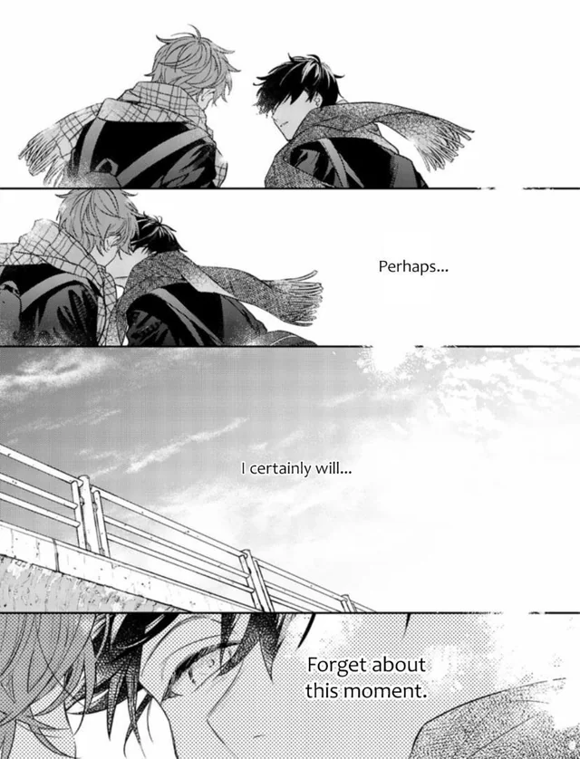

Hey 👋, I'm **cal** a Software Engineer at [Azalea](https://github.com/azaleateam). I specialize in backend development and handle DevOps from time to time.

I consider myself a Jack of all trades, but master of none due to how frequently my tech stack changes.

As of recent, I've been writing some small backend services in Elixir but I typically work with Kotlin, Go and TypeScript on a day-to-day basis.

  
  <b>Current Activity</b>  
    
  <b>Contact</b>  
  

<pre>
If you have any inquiries or wish to contact me
for whatever reason, you can do so via Discord:
    
@ sntl

This is my only public form of contact at this time.
</pre>
  

